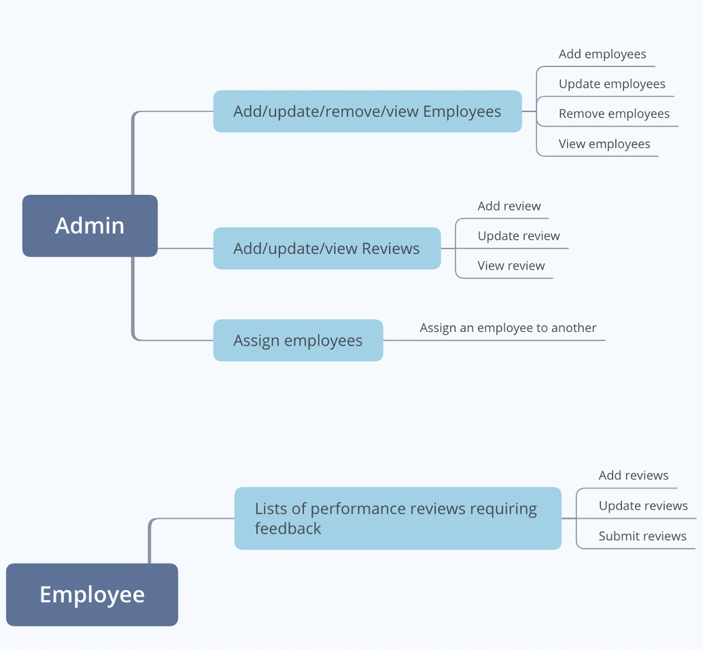
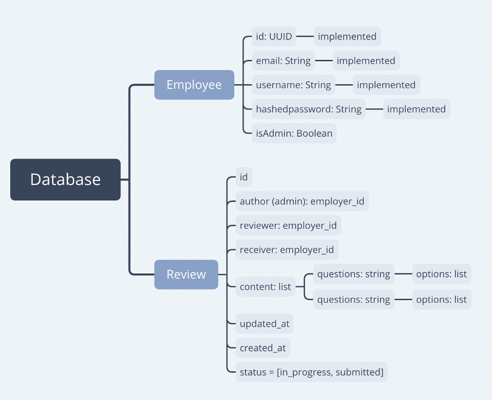

# Full Stack Developer Challenge
Fa-Lin (Roy) Wang

## Table of Contents
- Project Description
- How to Run
- How to Use
- Requirements
- Progress
- Challenge Scope

## Project Description
I create a CRUD employee performance review website using React, Express, Node.js, MySQL, and Tailwind CSS. The website allows users to create new accounts and stores hashed information using bcrypt on the database using MySQL. The front end is created using React.js and React Hook, cooperating with the utility-first CSS framework, and it is responsive and mobile-friendly. The backend is written in Node.js ES6.

## How to Run
- Local on Mac
1. First, you would need to install the dependencies with `npm install` in both server and client side.
2. For client, move to `/client` and run `npm start`, the default is run on [port 3000](http://localhost:3000/).
3. For server, open another terminal tap to `/server` and run `npm start`, the default is run on port 5000
4. When you open them successfully, you should see the screen like below.

## How to Use
You can sign up using username (required), email (required) and password more then 6 digits.

You can view the list of employees with the button "View All Employees" below.
You can also update the usernames or delete users.

## Progress 
- [x] High level description of design and technologies used
- [x] Server side API (Express and MySQL)
  - [x] GET /auth
  - [x] POST /auth/signup
  - [x] GET /employees
  - [x] PUT /employees/update
  - [x] DELETE /employees/delete/:id
- [x] Web app (React APP)
  - [x] Components: Navigation
    - responsive and with button to tap on on mobile
  - [x] Components: Footer
  - [x] Components: Sign Up Form
    - [x] integrate with /auth/signup API and add profile data to database
  - [x] Components: View All Employees
    - [x] integrate with GET/PUT/DELETE /employees APIS
    - [x] list out all the employee on the list
### Done
 - [x] Initiate [Product Requirement Document](assets/PerfomanceReview_PRD.docx)
 - [x] Create low-fidelity wireframes
 - [x] Comparative analysis
 - [x] Research which technology to use
 - [x] Initiate environment
 - [x] User authentication
 - [x] Add employees
 - [x] remove employees
 - [x] update employees
 - [x] List of employees

### Next Steps
 - [ ] Implement reviews database
 - [ ] Link 2 databases (employee and review)
 - [ ] Implement authorization (admin and non-admin)
 - [ ] Admin - add/update/view reviews
 - [ ] Employee - View list
 - [ ] Employee - Add and submit feedback
 - [ ] Deploy production

## Requirements
Design a web application that allows employees to submit feedback toward each other's performance review.

*Partial solutions are acceptable.*  It is not necessary to submit a complete solution that implements every requirement.
### Admin view
* Add/remove/update/view employees
* Add/update/view performance reviews
* Assign employees to participate in another employee's performance review

### Employee view
* List of performance reviews requiring feedback
* Submit feedback

## Challenge Scope
* High level description of design and technologies used
* Server side API (using a programming language and/or framework of your choice)
  * Implementation of at least 3 API calls
  * Most full stack web developers at PayPay currently use Java, Ruby on Rails, or Node.js on the server(with MySQL for the database), but feel free to use other tech if you prefer
* Web app
  * Implementation of 2-5 web pages using a modern web framework (e.g. React or Angular) that talks to server side
    * This should integrate with your API, but it's fine to use static responses for some of it 
* Document all assumptions made
* Complete solutions aren't required, but what you do submit needs to run.

## Reference
- [Tailwind Starter Kit by Creative Tim](https://www.creative-tim.com)
